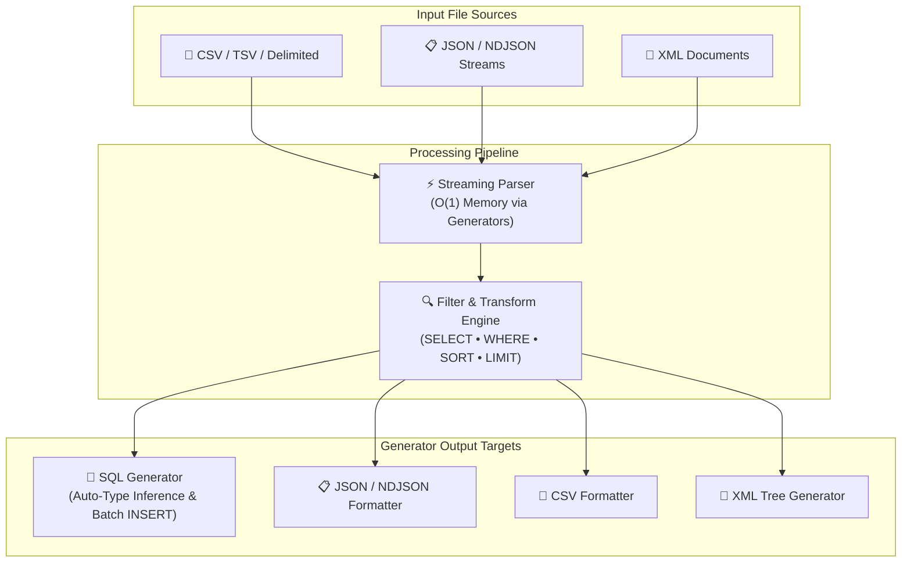

[🇸🇦 العربية](README.ar.md) | [🇬🇧 English](README.md)

# 🔄 eidcloud-data-transformer

> **Topics:** `eidcloud` `data-transformer` `csv-to-json` `sql-generator` `data-converter` `cli-tool` `php8`

[](https://github.com/shadialhasan/eidcloud-data-transformer/releases)
[](https://www.php.net/)
[](LICENSE)
[](https://colab.research.google.com/github/shadialhasan/eidcloud-data-transformer/blob/main/notebooks/quickstart.ipynb)

A universal, high-performance data converter and embedded query engine engineered in **Pure PHP 8.2+ with zero external vendor dependencies**. Seamlessly transforms, queries, projects, and generates datasets across **CSV**, **JSON / NDJSON**, **SQL Inserts (with schema generation)**, and **XML** with constant memory usage via streaming generators.

---

## 🏗️ Architecture & Pipeline Flow



---

## ⚡ Key Capabilities

- **Zero Vendor Dependencies:** 100% native PHP 8.2+ implementation using built-in extensions (`mbstring`, `simplexml`, `xmlreader`).
- **Memory-Efficient Streaming:** Employs PHP Generators (`yield`) to stream gigabyte-sized CSV, JSON, and XML files with near-zero memory footprint.
- **Universal Multi-Format Matrix:**
  - `CSV` ➔ `JSON`, `SQL`, `XML`, `NDJSON`
  - `JSON / NDJSON` ➔ `CSV`, `SQL`, `XML`
  - `XML` ➔ `JSON`, `CSV`, `SQL`
- **Embedded SQL-like Query Engine:**
  - **Column Projections:** `--select="id, name AS full_name, email"`
  - **Conditional Filtering:** `--where="status=active and (age >= 21 or role in ('admin', 'editor'))"`
  - **Pattern Matching & Checks:** `LIKE '%pattern%'`, `IS NULL`, `IS NOT NULL`, `>`, `<`, `>=`, `<=`, `!=`
  - **Multi-Column Sorting:** `--sort="created_at:desc, age:asc"`
  - **Pagination:** `--limit=50 --offset=100`
- **Intelligent SQL Generator:**
  - Auto-infers column types: `INT`, `BIGINT`, `DECIMAL(10,2)`, `TINYINT(1)` (Boolean), `TIMESTAMP`, `DATE`, `VARCHAR(N)`, and `TEXT`.
  - Produces clean, standards-compliant `CREATE TABLE IF NOT EXISTS` schemas with nullability detection.
  - Generates high-throughput batched multi-row `INSERT INTO` statements with robust SQL injection escaping.
- **CLI & Machine-Readable Output:** CLI binary `bin/eidcloud-data` with formatted terminal output or `--json` structured summary for automated pipelines.

---

## 📦 Installation & Setup

### Requirements
- **PHP 8.2** or higher
- Standard PHP extensions: `mbstring`, `xml`, `simplexml`

### Option 1: Git Clone (Standalone CLI & Tool)
```bash
git clone https://github.com/shadialhasan/eidcloud-data-transformer.git
cd eidcloud-data-transformer
chmod +x bin/eidcloud-data
```

### Option 2: Composer Dependency
```json
{
  "require": {
    "eidcloud/data-transformer": "^1.0"
  }
}
```

---

## 💻 CLI Usage

The executable CLI tool is located at `bin/eidcloud-data`.

### 1. Basic Conversions
```bash
# Convert CSV to Pretty JSON
php bin/eidcloud-data convert users.csv --to=json

# Convert CSV to Newline-Delimited JSON (NDJSON / JSONL)
php bin/eidcloud-data convert users.csv --to=json --ndjson --output=users.jsonl

# Convert JSON to CSV
php bin/eidcloud-data convert customers.json --to=csv --output=customers.csv

# Convert XML to CSV
php bin/eidcloud-data convert inventory.xml --to=csv
```

### 2. SQL Generation with Auto-Detected Types
```bash
# Generate CREATE TABLE and batch INSERT statements for MySQL/PostgreSQL
php bin/eidcloud-data convert orders.csv --to=sql --table=orders --output=orders.sql

# Custom batch size and omit CREATE TABLE
php bin/eidcloud-data convert orders.json --to=sql --table=orders --batch-size=500 --no-create-table
```

### 3. Filtering, Projection & Sorting
```bash
# Filter active adults and project specific columns
php bin/eidcloud-data convert users.csv \
  --to=sql \
  --table=verified_users \
  --select="id, name AS full_name, email, age" \
  --where="status = 'active' and age >= 21" \
  --sort="age:desc" \
  --output=verified_users.sql
```

### 4. Machine-Readable Summary (`--json`)
```bash
php bin/eidcloud-data convert users.csv --to=json --json
```
Output:
```json
{
  "status": "success",
  "input": "users.csv",
  "output": "users.json",
  "format": "json",
  "records_processed": 50000,
  "elapsed_time_ms": 142.35,
  "memory_peak_mb": 2.05
}
```

### 5. CLI Help Reference
```bash
php bin/eidcloud-data --help
```

---

## 🛠️ PHP API Usage

You can embed the transformer directly into any PHP application or microservice:

```php
use EidCloud\DataTransformer\Transformer;

$transformer = new Transformer();

// Fluent transformation with embedded query engine
$result = $transformer
    ->from('data/users.csv')
    ->select('id, name AS full_name, email, balance')
    ->where("status = 'active' and balance > 100.00")
    ->sort('balance:desc')
    ->limit(100)
    ->to('output/vip_users.sql', [
        'table' => 'vip_users',
        'create_table' => true,
        'batch_size' => 50,
    ]);

echo "Processed {$result['records_processed']} records in {$result['elapsed_time_ms']} ms.\n";
```

Direct one-liner conversion:
```php
$summary = (new Transformer())->convert('dataset.xml', 'json', [
    'output' => 'dataset.json',
    'where' => 'quantity > 0',
]);
```

---

## 🧪 Running Tests

The test suite runs with **zero vendor dependencies** using the standalone test runner:

```bash
php tests/run_tests.php
```

All 11 test suites verify:
- End-to-end multi-format conversions (CSV ⇄ JSON ⇄ SQL ⇄ XML).
- Query engine parser and WHERE logical operations (`AND`, `OR`, `LIKE`, `IN`, `IS NULL`).
- Column projections and aliasing.
- Sorting rules (numeric and alphabetical, ASC/DESC), limit and offset.
- Automatic SQL column type inference (`INT`, `BIGINT`, `DECIMAL`, `BOOLEAN`, `TIMESTAMP`, `DATE`, `VARCHAR`, `TEXT`).
- CLI process execution and machine-readable JSON flags.

---

## 👨‍💻 Author & Maintainer

**Eng. MHD. Shadi AL-Hasan**  
- **Location:** Damascus, Syria  
- **Email:** [mhd.shadi.alhasan@gmail.com](mailto:mhd.shadi.alhasan@gmail.com)  
- **Phone:** [+963 934 005 922](tel:+963934005922)  
- **GitHub:** [@shadialhasan](https://github.com/shadialhasan)  

---

## 📄 License

This software is released under the **MIT License**.  
Copyright (c) 2026 **MHD. Shadi AL-Hasan**. See the [LICENSE](LICENSE) file for details.

---

## 👤 Author & Maintainer

**Eng. MHD. Shadi AL-Hasan**  
- **Role:** Executive CTO & Enterprise Solutions Architect  
- **Email:** [mhd.shadi.alhasan@gmail.com](mailto:mhd.shadi.alhasan@gmail.com)  
- **Phone / WhatsApp:** [+963934005922](tel:+963934005922)  
- **Location:** Damascus, Syria  
- **GitHub:** [shadialhasan](https://github.com/shadialhasan)  

---

## 📄 License

This project is licensed under the MIT License - see the [LICENSE](LICENSE) file for details.  
Copyright (c) 2026 **MHD. Shadi AL-Hasan**. All rights reserved.
